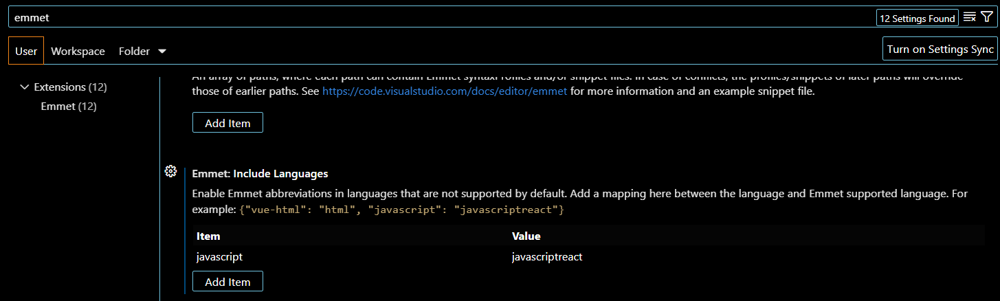

# frontend-with-reactjs
frontend-with-reactjs

1. Install Nodejs 
   https://nodejs.org/en/download
   NOTE: With nodejs installation npm (package manager) will also get installed

2. Check version after the installation
  > node.exe --version
    v18.17.0

  > npm --version
    9.6.7


3. Install the React Developer tools extension in Google Chrome
   https://chrome.google.com/webstore/detail/react-developer-tools/fmkadmapgofadopljbjfkapdkoienihi

4. Install extensions in vscode
   
   ```Thunder Client  - Same as Postman
   ES7 React/Redux/GraphQL/React-Native snippets  -> Simple extensions for React
   Auto Rename Tag - Auto rename paired HTML/XML tag
   Live Server - Launch a development local Server with live reload feature for static & dynamic pages
   Prettier Code formatter -  Code formatter using prettier

5. In the vscode, click on settings icon and then click on Settings.
   A new window will open, in the search box type - "Emmet" and scroll down and go to Emmet: Include Languages
   And then add javascript in the key and javascriptreact in the value as shown below in the image.
   

5. Follow the document from Reactjs to setup your project
   https://create-react-app.dev/docs/getting-started

6. Create project directory structure with npx
   ```npx create-react-app .

   NOTE: npx will be installed when you install nodejs from Step 1.

7. Start the npm server
   ```npm start```
   Open the browser and open this url - http://localhost:3000


8. Now we have to play with App.js and App.css file

9. Let's add the bootstrap CSS and JS CDN url in the index.html file
   Get the URL of CDN from https://getbootstrap.jp/docs/5.3/getting-started/introduction/

10. Now let's delete the content from index.css file 

11. Now copy the html code from bootstrap for Navbar and replace the class with className and also close the tags if not closed

12. To add the Date time calendar option install below packages
      ```npm install @mui/x-date-pickers
      npm install dayjs
      npm install dayjs
      npm install @mui/material @emotion/react @emotion/styled```

13. Copy the Javascript code of Date time picker from Material UI - https://mui.com/x/react-date-pickers/date-time-picker/
    and add the code in App.js file


